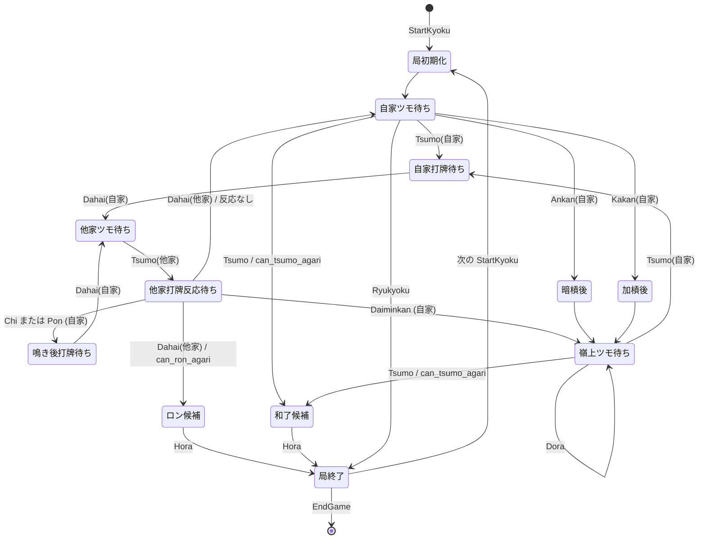
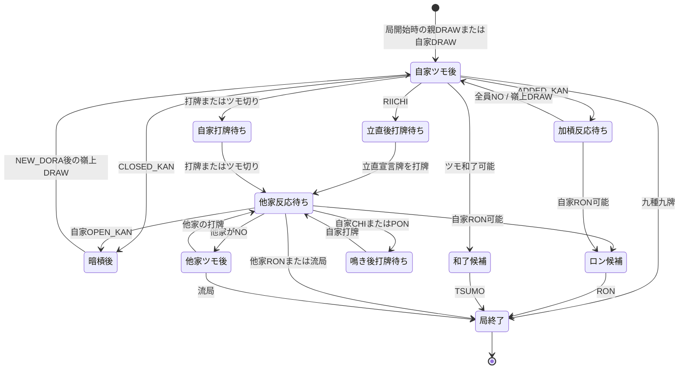
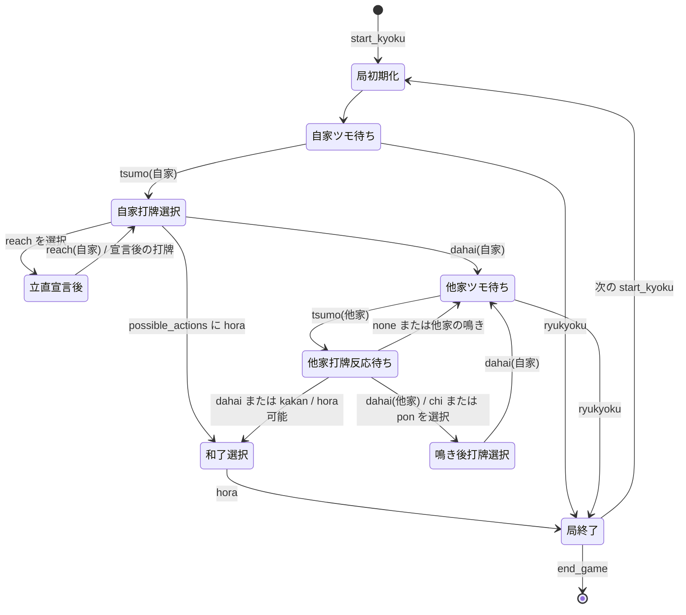
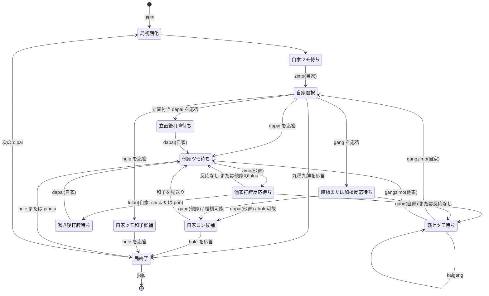
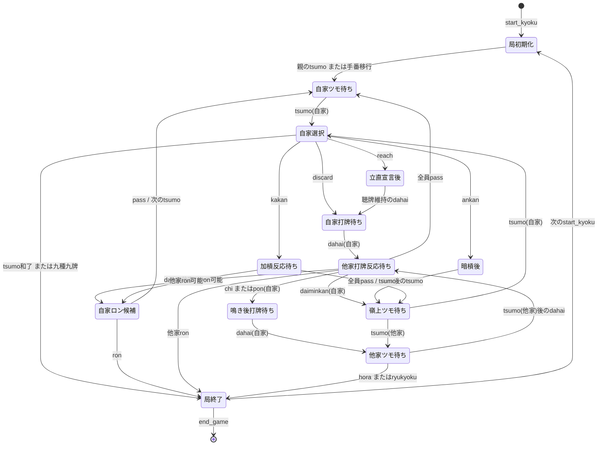

このファイルでは、プレイヤーの状態管理と手牌の管理について記述する。

# 調査対象
mapping.txtを参照のこと。それぞれdirectoryが掘られ、git submoduleで対象が取得済みである。

Mortal https://github.com/Equim-chan/Mortal
mjx https://github.com/mjx-project/mjx
mjai-manue https://github.com/gimite/mjai-manue
Majiang https://github.com/kobalab/Majiang
RiichiEnv https://github.com/smly/RiichiEnv

# 調査結果
## Mortal

### 構成と責務

Mortal では、`Mortal/libriichi/src/state/player_state.rs` の `PlayerState` が、
指定した一人の視点における観測可能な局面を管理する。完全情報の盤面を一つだけ保持する
設計ではなく、絶対座席番号 `player_id` ごとに `PlayerState` を生成し、同一のイベント列を
それぞれに適用する。座席に依存する値は自家を 0 とする相対座席に変換して保持する。

状態更新の入口は `Mortal/libriichi/src/state/update.rs` の `PlayerState::update` である。
`Mortal/libriichi/src/mjai/event.rs` の `Event` を一件ずつ受け取り、状態を更新した後、
次に自家が選べる操作を `ActionCandidate` として返す。概念的には次の reducer である。

```text
(state', legal_actions) = update(state, event)
```

局・対局全体の進行、山、点数精算、連荘・終局条件は `arena::BoardState` / `arena::Game` が
担当する。本節ではプレイヤー視点の状態に限定する。大局的なゲームの状態遷移は
[state-transition.md](state-transition.md) の Mortal 節を参照すること。

### 保持するプレイヤー状態

- **局情報**: 場風・自風、局番号、本場、供託、親、相対化した点数・順位、オーラス判定。
- **手牌**: `tehai: [u8; 34]` で赤牌を除いた種類別枚数を持つ。赤五牌は
	`akas_in_hand` で別管理し、ドラ所持数も併せて更新する。自家のツモ・打牌・副露消費だけが
	この手牌を直接増減させ、他家の非公開ツモ牌は入れない。
- **観測済みの牌**: `tiles_seen`、赤牌の出現、ドラ表示牌とドラ係数を記録する。配牌、
	自家ツモ、公開された捨て牌・副露牌・ドラ表示牌を `witness_tile` で記録し、5枚目を
	観測する不正なイベントはエラーにする。
- **公開領域**: 各家の河、最後の手出し・立直宣言牌、副露一覧、暗槓一覧を持つ。河の要素には
	捨て牌と、その直前に行われたチー・ポン・カンを対応付ける中間情報も保存する。
- **手牌評価と制約**: シャンテン、待ち、フリテン、食い替え禁止牌、門前、立直・一発・
	嶺上ツモ・槍槓の一時フラグ、カン数を保持する。手牌変化後には必要に応じて
	シャンテン、待ち、打牌候補を再計算する。

### Event と更新内容

`Event` は JSON の `type` をタグとする列挙型で、`actor` は絶対座席番号で表す。
`PlayerState::update` は更新の前に前回の `ActionCandidate` とカン候補を原則クリアし、
各イベント後の自家の合法操作を算出する。

| Event | 主な引数 | プレイヤー状態・手牌への更新 | 次の主な候補 |
| --- | --- | --- | --- |
| `StartGame` / `None` | 対局名、seed など | `PlayerState` の局面は更新しない | `StartKyoku` を待つ |
| `StartKyoku` | 場風、親、点数、配牌、ドラ表示牌 | 局情報、手牌、河、副露、立直、フリテン、一時状態をリセットし、配牌とドラを観測済みにする。シャンテン・待ちも算出する | 自家のツモ待ち |
| `Tsumo` | `actor`, `pai` | 残りツモ数を減らす。自家なら牌を手牌に加え、直前ツモ、手番、ドラ数を更新する。他家なら牌の正体は保持しない | 打牌、ツモ和了、立直、暗槓、加槓、九種九牌 |
| `Dahai` | `actor`, `pai`, `tsumogiri` | 自家なら手牌から除き、他家なら捨て牌を観測する。河、手出し、立直宣言牌を記録し、待ち・フリテンも更新する | 他家打牌ならロン、チー、ポン、大明槓 |
| `Chi` | `actor`, `target`, `pai`, `consumed` | 副露と河の対応を記録する。自家なら消費2牌を手牌から除き、門前を解除し、食い替え禁止・シャンテン・打牌候補を更新する | 鳴いた自家の打牌 |
| `Pon` | `actor`, `target`, `pai`, `consumed` | 副露と河の対応を記録する。自家なら消費2牌を除き、ポン情報、門前、食い替え禁止、シャンテンを更新する | 鳴いた自家の打牌 |
| `Daiminkan` | `actor`, `target`, `pai`, `consumed` | 副露、カン数、河の対応を更新する。自家なら消費3牌を除き、門前を解除して嶺上ツモ状態にし、シャンテン・待ちを更新する | ドラ表示、嶺上ツモ |
| `Kakan` | `actor`, `pai` | ポンを加槓へ置換し、カン数を増やす。自家なら追加牌を手牌から除き嶺上ツモ状態にする。他家の加槓なら槍槓ロン候補を作る | ドラ表示、嶺上ツモ、槍槓ロン |
| `Ankan` | `actor`, `consumed` | 暗槓とカン数を記録する。自家なら4牌を手牌から除き嶺上ツモ状態にする。立直前はシャンテン・待ちを更新する | ドラ表示、嶺上ツモ |
| `Dora` | `dora_marker` | ドラ表示牌を観測し、ドラ係数、既出ドラ数、手牌・副露のドラ所持数を再集計する | 次の自動イベント |
| `Reach` | `actor` | 立直宣言を記録する。自家では宣言後の打牌を可能にし、ダブル立直も記録する | 宣言牌の打牌 |
| `ReachAccepted` | `actor` | 立直受理、1000点支払い、供託、順位を更新する。自家では一発状態を開始する | 次のツモ・打牌 |
| `Hora` / `Ryukyoku` | 和了者、放銃者、点数差分など | `PlayerState` は手牌や点数精算を更新しない。和了・流局の確定と精算はゲーム進行側の責務 | 局終了 |
| `EndKyoku` / `EndGame` | なし | `PlayerState` をリセットしない。次の `StartKyoku` が局面を初期化する | 次局または終了 |

### 手牌更新と合法性

手牌の増減は `move_tile` に集約される。`Tsumo` は枚数と赤牌・ドラ所持を増やし、
`Discard` はそれらを減らす。`FuuroConsume` は副露に使う手牌を減らすが、公開された
副露のドラ数は別途記録する。打牌・副露で手牌にない牌を消費しようとすると更新は失敗する。

`ActionCandidate` は打牌、チー3種、ポン、大明槓、加槓、暗槓、立直、ツモ和了、ロン和了、
九種九牌流局を表す。実際に自家の反応イベントを送る前には `validate_reaction` を使え、
手牌に消費牌があること、チー元が上家であること、直前の河牌への反応であること、
候補として許可された操作であることを検証する。

### プレイヤー視点の状態遷移

次図は `PlayerState` が受け取るイベントに対する、自家の手牌と反応候補に関する遷移である。
`Hora`、`Ryukyoku` 後の局全体の遷移は前述の [state-transition.md](state-transition.md) を参照する。



## mjx

### 構成と責務

mjx では、`mjx/include/mjx/internal/state.h` の `State` が局の完全情報を管理する。
`State` は山と裏ドラを `HiddenState`、局開始時の点数・ドラ表示牌・公開イベント列を
`PublicObservation`、各席の配牌・ツモ履歴・現在手牌を `PrivateObservation` として保持する。
4 人分の内部 `Player` には `Hand` のほか、待ち、捨て牌種、見逃し牌によるフリテン、
一発、流し満貫の可否を持つ。

AI に渡すのは完全情報の `State` そのものではなく、`State::CreateObservations` が生成する
`Observation` である。`Observation` は、全員に共通の公開情報・イベント履歴と、観測者だけの
`PrivateObservation` を組み合わせる。このため他家のツモは `DRAW` イベントとして手番だけが
公開され、牌の実体は当人の `draw_history` にしか入らない。一方、他家の打牌、和了牌、
副露、ドラ表示牌は公開イベントに記録される。

状態更新の入口は `State::Update` である。これはエージェントが選んだ `Action` を受け、
手牌と局面を更新し、公開された結果を `Event` として追記する。複数人の反応がある場合は
ロン、明槓、ポン、チー、何もしない、の優先順位で解決し、複数ロンは放銃者からの席順で
処理する。`NO` と競合により不採用となった鳴きは公開されないため、イベント履歴には残らない。

局の進行、山からの牌の供給、点数精算、連荘および対局終了の判定も `State` が実装するが、
大局的なゲームの状態遷移は [state-transition.md](state-transition.md) の mjx 節を参照すること。
ここではプレイヤーに提示される観測、手牌、合法操作に限る。

### 保持するプレイヤー状態と手牌

- **公開局面**: 起家順のプレイヤー ID、局・本場・供託・点数、ドラ表示牌、公開された
	`Event` 列を持つ。観測者は絶対座席番号 `who` で表す。
- **非公開情報**: 各席について配牌 `init_hand`、その席だけが知る `draw_history`、
	同期用の `curr_hand` を持つ。完全情報の `State` は山と裏ドラも保持するが、これらは
	`Observation` に含めない。
- **手牌**: `Hand` は実牌 ID の `closed_tiles_` と `opens_` を保持する。`Open` にはチー、
	ポン、明槓、暗槓、加槓と、鳴いた相手・取得牌を符号化して保存するため、赤五牌も通常牌と
	区別して扱える。`curr_hand` は手牌変更のたびに `Hand::ToProto` で更新される。
- **手牌段階と制約**: ツモ後、立直直後、チー後、ポン後、各カン後、ロン・ツモ和了後を
	`HandStage` として区別する。最後に加わった牌、立直・ダブル立直、門前、食い替え禁止牌も
	管理し、立直中は原則としてツモ切りだけを許す。立直後の暗槓はカンの前後で待ちが変わらない
	場合だけ候補になる。
- **評価・反応のための一時情報**: `Player` は待ち、過去の捨て牌種、見逃したロン牌、
	一発、流し満貫の可否を持つ。ロン可否は和了形に加え、役、捨て牌フリテンと見逃しフリテンを
	確認する。`Hand` はシャンテン数と有効牌を API として計算できるが、これらは状態として
	キャッシュせず必要時に算出する。

`Observation::current_hand` は、観測者の配牌を起点に、公開イベントのうちその観測者が
行ったツモ・打牌・副露・立直・和了だけを順に再適用して再構築できる。この性質により、
公開履歴から他家の手牌を復元することはできない。

### Event と更新内容

`Action` はエージェントが選択する操作、`Event` はその結果として公開された操作または環境遷移で
ある。`who` は起家を 0 とする絶対座席番号であり、`tile` は実牌 ID、`open` は副露を表す。
`DRAW` の `tile` は非公開で、`NEW_DORA` のみ `who` を持たない。

| Event | 主な引数 | 状態・手牌への更新 | 次の主な合法操作 |
| --- | --- | --- | --- |
| `DRAW` | `who` | 山から通常ツモまたは嶺上ツモを行い、当人の閉じた手牌と非公開ツモ履歴に牌を追加する。ロン見逃しの記録を更新し、非立直者のフリテンを解除する | 当人の打牌・ツモ切り、ツモ和了、立直、暗槓、加槓、条件を満たせば九種九牌 |
| `DISCARD` / `TSUMOGIRI` | `who`, `tile` | 当人の閉じた手牌から牌を除く。捨て牌種、聴牌時の待ち、一発消滅、流し満貫の可否を更新する。`TSUMOGIRI` は最後に加わった牌を捨てたことを表す | 他家のロン、チー、ポン、明槓、または `NO` |
| `RIICHI` | `who` | 門前かつ聴牌可能な手牌を立直状態にし、ダブル立直かも記録する。このイベント時点では供託をまだ減らさない | 当人の聴牌を維持する打牌 |
| `RIICHI_SCORE_CHANGE` | `who` | 1000 点を支払い、供託を増やし、一発を有効にする。立直宣言牌への反応が解決された後に自動追加される | 次のツモまたは打牌 |
| `CHI` / `PON` | `who`, `open` | `open` に含まれる手牌消費牌を閉じた手牌から除いて副露へ追加する。食い替え禁止牌を設定し、一発を全員について消す | 鳴いた当人の打牌 |
| `OPEN_KAN` | `who`, `open` | 明槓として手牌 3 枚を副露へ移し、一発を全員について消す。直後に嶺上ツモを行う | ドラ表示、当人の嶺上ツモ後の操作 |
| `CLOSED_KAN` | `who`, `open` | 暗槓として閉じた手牌 4 枚を副露へ移す。立直中は待ち不変の場合だけ許可する。必要なカンドラを公開してから嶺上ツモを行う | ドラ表示、当人の嶺上ツモ後の操作 |
| `ADDED_KAN` | `who`, `open` | 既存のポンを加槓に置換し、追加の 1 枚を閉じた手牌から除く。当人の一発を消す | 他家の槍槓ロンまたは `NO`。全員が `NO` なら嶺上ツモ |
| `NEW_DORA` | `tile` | 山から次のドラ表示牌と非公開の裏ドラ表示牌を追加する。手牌そのものは変えない | カンに続く嶺上ツモまたは次の処理 |
| `TSUMO` | `who`, `tile` | 当人の手牌をツモ和了状態にし、和了形を終局情報へ記録する | 局終了 |
| `RON` | `who`, `tile` | 直前の打牌または加槓牌を当人の手牌に加えてロン和了状態にし、和了形を終局情報へ記録する。ダブルロンも連続したイベントとして表す | 局終了 |
| `ABORTIVE_DRAW_NINE_TERMINALS` | `who` | 九種九牌流局として、宣言者の手牌を聴牌手牌情報へ記録する | 局終了 |
| `ABORTIVE_DRAW_FOUR_RIICHIS` / `ABORTIVE_DRAW_THREE_RONS` / `ABORTIVE_DRAW_FOUR_KANS` / `ABORTIVE_DRAW_FOUR_WINDS` | なし | 四家立直、三家和、四槓散了、四風連打として流局を確定する | 局終了 |
| `EXHAUSTIVE_DRAW_NORMAL` / `EXHAUSTIVE_DRAW_NAGASHI_MANGAN` | なし | 牌山枯渇時に聴牌料を計算する。流し満貫が成立していれば後者へ置き換え、点数移動と終局情報を記録する | 局終了 |

### 手牌更新と合法性

`Hand::Draw` は閉じた手牌に一意な実牌を追加し、直前に加わった牌と段階を更新する。
`Hand::Discard` はその牌が手牌にあり、現在の段階で捨てられ、食い替え禁止でなく、立直中なら
最後のツモ牌であることを検証してから除去する。副露も `ApplyOpen` を経由し、消費牌が閉じた
手牌に実在することを検証する。したがって、不正な手牌消費は内部 `Assert` により拒否される。

合法操作の生成は主に `State::CreateObservations` が担当する。ツモ直後は打牌に加え、和了、
立直、暗槓・加槓、九種九牌を調べる。打牌後は各他家について、役・フリテンを含むロン判定と、
相対位置を用いたチー、ポン、明槓の候補を作り、候補があれば `NO` も追加する。チーは上家の
打牌に限られ、立直中は副露できない。複数の応答は `State::Update` で優先順位に従って解決する。

### プレイヤー視点の状態遷移

次図は `Observation` を受け取る一人のエージェントから見た、手牌変更と合法操作の遷移である。
終局後の次局開始、連荘、対局終了などの大局的な遷移は
[state-transition.md](state-transition.md) を参照すること。



## mjai-manue

### 構成と責務

mjai-manue には、CoffeeScript 版の `coffee/game.coffee` に局面をイベントから再構成する
`Game` があり、`coffee/tcp_client_game.coffee` の `TCPClientGame` が MJSON を `Action` に
変換してこれを更新する。受信した各イベントは、状態更新後に `ManueAI#respondToAction` へ渡され、
応答が必要な局面なら一件のアクションを返す。概念的には次の reducer として動作する。

```text
(state', response) = updateState(state, action), respondToAction(state', action)
```

`Game` は局面の観測状態と手牌の再構成を担当する。ツモ牌を含む局の生成、和了・流局時の
点数計算、親の継続、次局・終局の判断といった大局的なゲーム進行は、ここでは扱わない。
読み手は [state-transition.md](state-transition.md) を参照すること。

配布される Ruby 版では、`Mjai::Manue::Player < Mjai::Player` が共通 `mjai` gem の
プレイヤー状態を利用し、`respond_to_action` で同様に和了、立直、打牌、鳴きの選択を行う。
以下の状態再構成は、リポジトリ内でその更新規則を実装している CoffeeScript 版を基準にする。

### 保持するプレイヤー状態と手牌

- **局情報**: 場風、局数、本場、親、起家、ドラ表示牌、残り山牌数を持つ。`start_kyoku` で
  初期化し、`tsumo` ごとに残り山牌数を 1 減らし、`dora` でドラ表示牌を追加する。
- **各家の状態**: 四人の `player` ごとに、ID・名前・点数、`tehais`、副露 `furos`、河 `ho`、
  捨て牌履歴 `sutehais`、追加安全牌 `extraAnpais`、立直状態と立直牌の河・捨て牌上の位置を持つ。
  `scores` を持つイベントは全員の点数を同時に更新する。
- **手牌と未知牌**: 手牌は `Pai` の配列であり、牌姿を知る自家には実牌、他家には
  `Pai.UNKNOWN` を入れて保持できる。`deleteTehai` は同一牌を優先して取り除き、実牌がない場合は
  未知牌を消費する。従って公開イベントから他家の手牌枚数と副露は追跡しつつ、非公開のツモ牌を
  推測しない。
- **公開領域と安全牌**: `Furo` は種別、取得牌、手牌からの消費牌、鳴かれた相手を保持する。
  鳴かれた牌は相手の河から取り除く。河と副露、ドラ表示牌、自家手牌を `visiblePais` として集計し、
  安全牌は自分の捨て牌と、和了でなかった直前の他家打牌を合わせて扱う。
- **評価用の一時状態**: 聴牌判定は `ShantenAnalysis` で必要時に計算し、局面変更ごとに
  `@_tenpais` のキャッシュを無効化する。`reachState` は `none`、`declared`、`accepted` を取り、
  受理済み立直者については安全牌の扱いを維持する。

### Event と更新内容

MJSON の一行は `Action.fromJson` で `Action` に変換される。`actor` と `target` は `Player`
オブジェクトへ解決されるため、`Game#updateState` はイベントの主体・対象を直接比較して更新できる。

| Event | 主な引数 | 状態・手牌への更新 | Manue の主な応答 |
| --- | --- | --- | --- |
| `start_game` | `id`, `names` | 四人を生成し、点数を 25000 に初期化する。局情報と各家の手牌・河・副露・立直情報を未設定にする | 自家 ID を記録して AI を初期化。通常は `none` |
| `start_kyoku` | 場風、局、本場、親、ドラ表示牌、`tehais` | 局情報、ドラ表示牌、残り山牌数を初期化する。各家の配牌、空の副露・河・捨て牌、安全牌、未立直状態を設定する | `none` |
| `tsumo` | `actor`, `pai` | 残り山牌数を減らす。自家なら実牌、他家なら通常は未知牌をその家の手牌末尾へ加える | 自家なら和了、立直、打牌を検討。受理済み立直ならツモ切り |
| `dahai` | `actor`, `pai`, `tsumogiri` | 主体の手牌から牌または未知牌を一枚除き、整列後に河・捨て牌履歴へ加える。未受理立直者の追加安全牌を消去する | 他家打牌ならロンを優先し、候補があればチー・ポンを評価。どれも選ばなければ `none` |
| `chi` / `pon` | `actor`, `target`, `pai`, `consumed` | 主体の手牌から消費牌を除き、取得牌・消費牌・対象を含む副露を追加する。対象の河から取得牌を取り除く | 鳴いた自家は和了可否を確認後、打牌を選ぶ |
| `daiminkan` | `actor`, `target`, `pai`, `consumed` | 明槓として三枚を手牌から副露へ移し、対象の河から取得牌を取り除く | 状態は追跡するが、CoffeeScript 版の Manue は明槓候補を選択しない |
| `ankan` | `actor`, `consumed` | 暗槓の消費四枚を手牌から除き、副露を追加する | 状態は追跡する。Manue の応答分岐は暗槓を生成しない |
| `kakan` | `actor`, `pai` | 手牌から追加牌を除き、同種の既存ポンを取得牌・消費牌を保った加槓副露へ置換する | 他家の加槓ならロン候補だけを確認 |
| `dora` | `dora_marker` | 新しいドラ表示牌を追加する。手牌は変化しない | `none` |
| `reach` | `actor` | 主体を `declared` にする | 自家では立直宣言後に打牌を選ぶ |
| `reach_accepted` | `actor`, `scores` | 主体を `accepted` にし、立直牌の河・捨て牌位置を記録する。点数があれば全員分を更新する | `none` |
| `hora` / `ryukyoku` / `end_kyoku` / `end_game` | 和了・流局情報、`scores` | `Game` は手牌・河をリセットしない。`scores` があれば点数だけ反映し、局の確定処理は外側の進行に委ねる | `none`。`end_game` 後は TCP 接続を閉じる |

### 手牌更新と操作選択

手牌の増減は `Game#updateState` に集約される。打牌・副露・加槓で `deleteTehai` が対象牌を
消費できなければ例外となるため、更新済みの手牌枚数と公開された操作の整合性を保つ。一方で
`Action` 自体の合法性を網羅検証する層はなく、サーバーから与えられる `possible_actions` と
`cannot_dahai` を、応答を必要とするイベントで参照する設計である。

CoffeeScript 版の `ManueAI` は、自家の `tsumo`、`chi`、`pon`、`reach` に対して、まず
`possible_actions` 内の和了を選び、次に立直または打牌を選ぶ。他家の `dahai` と `kakan` には
和了を最優先し、残る副露候補は鳴かない場合も含めて評価する。候補がない、または自分の手番で
ないイベントには必ず `none` を返す。打牌・立直・鳴きの評価には、シャンテン、可視牌、残りツモ、
和了確率・期待点・立直者への危険度を用いる。

Ruby 版の `Mjai::Manue::Player` も同じ優先順位で和了、立直、打牌、チー・ポンを判断するが、
`daiminkan` は明示的に候補から除外している。そのため、状態管理が追跡できる操作と、Manue が
実際に選択する操作は区別して読む必要がある。

### プレイヤー視点の状態遷移

次図は、MJSON を受け取る一人の Manue から見た手牌更新と応答候補の遷移である。終局後の
次局開始、連荘、点数精算、対局終了の大局的な遷移は [state-transition.md](state-transition.md)
を参照すること。



## Majiang

### 構成と責務

Majiang 本体は `Majiang/src/js/majiang.js` で `@kobalab/majiang-core` を読み込む
アプリケーションであり、プレイヤー視点の状態再生は同パッケージの `Player` と `Board` が
担う。`Player#action` は受信メッセージに含まれるイベントを一件ずつ `Board` に適用し、
更新後に `action_zimo` や `action_dapai` などのフックを呼ぶ。AI はこの `Player` の具体実装で、
人間用 UI プレイヤーも同じイベント列を受け取る。概念的には次の reducer である。

```text
(view_state', reply) = update(view_state, event), decide(view_state', event)
```

実際の牌山、全員の実手牌、反応の競合解決、和了・流局の精算、連荘・終局判定は
`Game` が保持する完全情報のモデルで行う。本節は各 `Player` に配られる観測状態と手牌を
対象とする。大局的なゲームの状態遷移は [state-transition.md](state-transition.md) の
Majiang 節を参照すること。

`Game` は各イベントを座席ごとのメッセージに複製して送るが、配牌 `qipai.shoupai` と
ツモ `zimo.p` / `gangzimo.p` は当人以外には空文字に置き換える。`Board#qipai` は空の配牌を
未知牌 13 枚、`Board#zimo` は空のツモを未知牌 1 枚として `Shoupai` に格納する。このため、
全員が同じ公開イベント列を処理しても、他家の牌姿を推測せずに手牌枚数、副露、河を追跡できる。

### 保持するプレイヤー状態と手牌

- **卓・局情報**: 起家 `qijia`、場風 `zhuangfeng`、局数 `jushu`、本場 `changbang`、
  供託 `lizhibang`、ID ごとの点数 `defen`、現在の手番 `lunban`、座席順と ID の対応
  `player_id` を `Board` が持つ。`menfeng(id)` は対象 ID を局内の相対座席へ変換する。
- **観測された山と公開領域**: `Board` 内部の `Shan` は残り牌数 `paishu`、ドラ表示牌
  `baopai`、和了時に開示された裏ドラ `fubaopai` を持つ。各家には河 `He` と手牌
  `Shoupai` があり、`He` は捨て牌順 `_pai`、その牌種を一度でも捨てたかを引ける `_find` を
  管理する。鳴かれた直前の河牌は削除せず、面子の方向記号を付加して関連付ける。
- **手牌**: `Shoupai` は閉じた牌を色・数字別の枚数 `_bingpai` で管理する。`_bingpai._` は
  非公開の未知牌数で、赤五牌は 0 と通常の 5 の枚数を併用して区別する。副露は符号化文字列の
  配列 `_fulou`、直近に加わったツモ牌または鳴いた面子は `_zimo`、立直済みは `_lizhi` に保持する。
  したがって、`toString()` は自家なら実牌、他家なら `_` を含む手牌表現を返す。
- **プレイヤー視点の一時状態**: `Player` は自風 `_menfeng`、第一ツモか `_diyizimo`、
  自分が行ったカン数 `_n_gang`、ロンを見逃していないか `_neng_rong` を持つ。
  `hulepai` は現在のシャンテン数と待ちを `Util.xiangting` / `Util.tingpai` から都度求める。
  よってシャンテン数・待ちは状態としてキャッシュしない。

### Event と更新内容

Majiang の牌譜・プレイヤー通知は、イベント名をキーとするオブジェクトで表す。座席 `l` は
局内の相対座席、牌 `p` と面子 `m` は文字列である。副露面子の `+`、`=`、`-` はそれぞれ
鳴いた相手の相対方向を表す。`Game` が返信を受けて合法性と競合を解決するが、`Player` は
受信済みのイベントを `Board` へそのまま再生する。

| Event | 主な引数 | プレイヤー状態・手牌への更新 | 次の主な応答 |
| --- | --- | --- | --- |
| `kaiju` | `id`, ルール、プレイヤー名、起家 | `Board` 全体を初期化し、自分の ID とルールを記録する | `action_kaiju`。通常は応答なし |
| `qipai` | 場風、局、本場、供託、点数、ドラ表示牌、4 家の配牌 | 局情報、河、手番を初期化する。自家配牌だけは実牌、他家は未知牌 13 枚で `Shoupai` を作る | 親の `zimo` を待つ |
| `zimo` | `l`, `p` | `lunban` をツモ者にし、山の残りを 1 減らして手牌へ加える。自家以外の `p` は未知牌として加わる | ツモ者なら和了、九種九牌、カン、立直、打牌 |
| `dapai` | `l`, `p` | 主体の手牌から牌を 1 枚除き、河へ追加する。末尾の `*` は立直宣言を示し、次のツモまたは鳴き時に供託を反映する | 他家はロン、ポン、大明槓、下家のみチー。反応なしなら次の `zimo` |
| `fulou` | `l`, `m` | 鳴かれた直前の河牌に方向を記録し、主体の `Shoupai#fulou` で消費牌を除いて副露へ追加する。チー・ポン・大明槓を同じイベントで表す | 大明槓なら `gangzimo`、チー・ポンなら鳴いた者の打牌 |
| `gang` | `l`, `m` | 暗槓または加槓を `Shoupai#gang` で適用する。暗槓は閉じた牌 4 枚を副露へ移し、加槓は既存ポンを置換して追加牌を消費する | 加槓には他家の槍槓ロン、なければ `gangzimo` |
| `gangzimo` | `l`, `p` | 嶺上牌を主体の手牌へ追加し、全員の一発状態を無効にする。他家には未知牌として届く | ツモ者の和了、カン、立直、打牌 |
| `kaigang` | 新ドラ表示牌 `baopai` | 観測済みドラ表示牌へ追加する。手牌は変化しない | 次の自動イベント |
| `hule` | 和了者、放銃者、和了手牌、裏ドラ、点数配分 | 和了者の手牌を確定表現で上書きする。点数配分は保持し、後続の和了または局終了で確定する | `action_hule`。局終了処理へ |
| `pingju` | 流局名、開示手牌、点数配分 | 開示された聴牌手牌を更新し、局の点数配分・連荘情報を保持する | `action_pingju`。局終了処理へ |
| `jieju` | 最終牌譜、最終点数・順位 | 最終点数を反映し、手番を未設定へ戻す | `action_jieju`。対局終了 |

### 手牌更新と合法性

`Shoupai` の操作が手牌の整合性を担保する。`zimo` は直前のツモまたは鳴きが残っていないこと、
牌の形式と同種 4 枚上限を検査してから加える。`dapai` はツモ後であることを確認し、実牌が
なければ未知牌を消費する。`fulou` はツモ後でないこと、面子形式、消費牌を検証してから
副露へ移す。`gang` はツモ後であることと、暗槓または既存ポンへの加槓であることを検証する。
不整合なイベントは例外となる。

打牌候補 `get_dapai` は、副露直後の食い替え禁止と立直後のツモ切りを `Shoupai` 側で反映する。
チー・ポン・大明槓は副露前かつ非立直であることを確認し、チーは上家方向 `-` の牌だけを
候補にする。`Game.get_*_mianzi` はこれらに残り山なし、ルールごとの食い替え、4 回カン制限を
加える。立直後の暗槓はルール設定に従い、待ちまたは和了形数が悪化しない場合だけ許可する。

和了判定 `allow_hule` は和了形に加え、役の有無、立直・海底・嶺上などの状況役、河に待ち牌が
あるフリテン、見逃しを `_neng_rong` で確認する。自家または他家の和了可能牌を見逃したときは
`Player#dapai` / `Player#gang` が `_neng_rong` を偽にし、次に自家が打牌するまでロンを禁止する。
`Game` は返信を受け、ロン、明槓、ポン、チー、反応なしの順に競合を解決する。

### プレイヤー視点の状態遷移

次図は、一人の `Player#action` がイベントを受けて手牌を再構成し、`action_*` フックで
応答する局面を抽象化したものである。和了後の点数精算、連荘、次局、対局終了の大局的な遷移は
[state-transition.md](state-transition.md) を参照すること。



## RiichiEnv

### 構成と責務

RiichiEnv では、`RiichiEnv/riichienv-core/src/state/mod.rs` の `GameState` が、山と
4 人分の `PlayerState` を含む局の完全情報を管理する。エージェントへ完全情報を直接渡す
のではなく、`GameState::get_observation` が指定席向けの `Observation` を作る。これは自家の
閉じた手牌だけを残し、他家の `hand` は空配列にマスクした、公開副露・河・ドラ表示牌・
点数・立直情報・合法操作・差分 MJSON イベントからなる観測である。従って、同一の
`GameState` から席ごとに異なる観測を得る設計であり、他家のツモ牌を観測者へ開示しない。

状態更新の入口は `GameState::step` である。現在の `Phase` に従って各席の `Action` を
`_get_legal_actions_internal` の候補と照合し、手牌、河、副露、山を更新する。打牌後は
`WaitResponse` に移って複数席の反応を集め、ロン、ポン・大明槓、チーの優先順位で解決する。
処理済みの結果は `_push_mjai_event` により MJSON として記録され、各観測の `new_events()` で
増分を受け取れる。牌譜再生時は `replay/mjai_replay.rs` の `MjaiEvent` を
`GameStateEventHandler::apply_mjai_event` に適用して、同じ状態を復元できる。

和了・流局の点数精算、連荘、局・対局終了の判定も `GameState` に実装される。ただし本節は
プレイヤーの観測と手牌に限定する。大局的なゲームの状態遷移は
[state-transition.md](state-transition.md) を参照すること。

### 保持するプレイヤー状態と手牌

- **局面と反応状態**: `GameState` は現在手番 `current_player`、`WaitAct` / `WaitResponse`
  の `phase`、反応可能者 `active_players`、直前の捨て牌 `last_discard`、各席の反応候補
  `current_claims`、槍槓確認中の `pending_kan` を持つ。局情報として親、場風、局番号、本場、
  供託、残り山・嶺上牌・ドラ表示牌も保持する。
- **各家の公開状態**: `PlayerState` は河 `discards`、各打牌の手出し・立直宣言フラグ、
  副露 `melds`、点数と局内の差分を持つ。`Meld` はチー、ポン、大明槓、暗槓、加槓の種別、
  実牌 ID、鳴いた相手、取得牌を保存する。
- **手牌**: 閉じた手牌は `hand: Vec<u8>` であり、0--135 の一意な実牌 ID を保持する。
  同じ牌種は ID を 4 で割った値で比較し、赤五牌も別の実牌 ID として区別する。ツモ・打牌・
  副露・カンはこの配列を直接増減させ、常にソートする。観測時には自家以外のこの配列を空に
  するため、公開情報から他家の手牌を復元できない。
- **立直・フリテンなどの制約**: `riichi_stage` は宣言から宣言牌打牌まで、
  `riichi_declared` は受理後の立直を表す。ダブル立直、一発、見逃しによる同巡・立直
  フリテン、流し満貫の可否、食い替え禁止牌、責任払い対象も状態として持つ。自家打牌後に
  同巡フリテンは解除され、立直後はツモ切りのみが候補になる。
- **評価結果**: `Observation` には自家の `HandEvaluator` から計算した待ち `waits` と
  `is_tenpai` を格納する。和了、立直、鳴き、カンの可否も、手牌・副露・河・山・役条件を
  用いて合法操作の生成時に判定し、恒久的なシャンテン値としては保持しない。

### Event と更新内容

`MjaiEvent` は JSON の `type` をタグとする列挙型で、`actor` と `target` は絶対席番号、
牌は MJSON の文字列表現で渡る。通常対局で生成するイベントは `Action` から変換され、
牌譜再生では `apply_mjai_event` が同じ主要状態を更新する。

| Event | 主な引数 | 状態・手牌への更新 | 次の主な合法操作 |
| --- | --- | --- | --- |
| `start_game` | 名前、ID | 再生時のアクティブな手番・反応者をクリアする | `start_kyoku` を待つ |
| `start_kyoku` | 場風、局、本場、供託、親、点数、ドラ表示牌、4家の配牌 | 局の一時状態と各 `PlayerState` をリセットし、点数、配牌、ドラ表示牌、山の残りを設定する | 親の `tsumo` |
| `tsumo` | `actor`, `pai` | ツモ者の `hand` に実牌を追加し、直前ツモ、手番、残り山、食い替え禁止を更新する | 打牌、ツモ和了、立直、暗槓、加槓、九種九牌 |
| `dahai` | `actor`, `pai`, `tsumogiri` | 牌を手牌から除き、河、直前捨て牌、手出し・立直打牌情報、流し満貫・同巡フリテンを更新する。全他家のロン・ポン・大明槓・チー候補を作る | 反応者のロン、チー、ポン、大明槓、`pass` |
| `chi` / `pon` | `actor`, `target`, `pai`, `consumed` | 消費 2 牌を手牌から除き、取得牌とともに開いた副露へ追加する。食い替え禁止を設定し、一発を全員について消す | 鳴いた者の打牌 |
| `daiminkan` (`kan`) | `actor`, `target`, `pai`, `consumed` | 消費 3 牌を除いて大明槓を追加し、一発を消す。カンドラと嶺上ツモを処理する | ドラ表示、嶺上 `tsumo` 後の操作 |
| `ankan` | `actor`, `consumed` | 4 牌を閉じた手牌から暗槓へ移す。立直後は待ちが変わらない場合だけ候補となる。カンドラを開示して嶺上ツモする | ドラ表示、嶺上 `tsumo` 後の操作 |
| `kakan` | `actor`, `pai` | 追加 1 牌を手牌から除き、既存ポンを加槓へ置換する。先に他家の槍槓ロンを受け付け、なければ嶺上ツモする | 槍槓ロンまたは嶺上 `tsumo` |
| `dora` | `dora_marker` | ドラ表示牌を山の公開情報に追加する。手牌は変えない | 次の自動イベント |
| `reach` | `actor` | `riichi_stage` を設定する。この時点では供託支払いも立直確定も行わない | 聴牌を維持する宣言牌の打牌 |
| `reach_accepted` | `actor` | 立直を確定し、1000 点を支払い、供託を増やして一発を有効にする | 次のツモまたは打牌 |
| `hora` | 和了者、放銃者、点数差分、裏ドラ | 和了結果と点数を記録する。手牌の終局表現は再構成せず、局の完了へ進む | 局終了 |
| `ryukyoku` | 理由、開示手牌、点数差分 | 流局を確定し、必要なら点数・開示手牌を記録する | 局終了 |
| `end_kyoku` / `end_game` | なし | 局または対局の終端を通知する。次局の手牌初期化は次の `start_kyoku` が担う | 次局または終了 |

### 手牌更新と合法性

`step` は、各 `Action` が現在の合法候補と一致することを検証してから適用する。不正な操作が
渡された場合は `last_error` に記録し、流局として処理する。通常の打牌は手牌中の実牌を一枚
除き、立直中は直前ツモ牌だけを許す。チーは下家だけ、ポン・大明槓は立直者以外だけに提示し、
食い替え後に打牌可能な牌が残るかも確認する。暗槓・加槓はツモ後だけに生成し、立直後の暗槓は
前後の待ちが同一である場合に制限する。

打牌後の反応では、役を含む和了判定と河・見逃しによるフリテンを確認してロンを作る。
反応可能者には常に `pass` が提示され、ロンを見送ると同巡フリテンとなり、立直中なら以後も
フリテンとなる。複数の回答はロンを最優先にし、その後はポン・大明槓をチーより優先する。
カン後はカンドラと嶺上牌を自動処理し、`tsumo` イベントとして観測へ追加する。

### プレイヤー視点の状態遷移

次図は、ある席に返される `Observation` と `legal_actions` から見た手牌更新・応答の遷移で
ある。終局後の点数精算、連荘、次局、対局終了の大局的な遷移は
[state-transition.md](state-transition.md) を参照すること。


