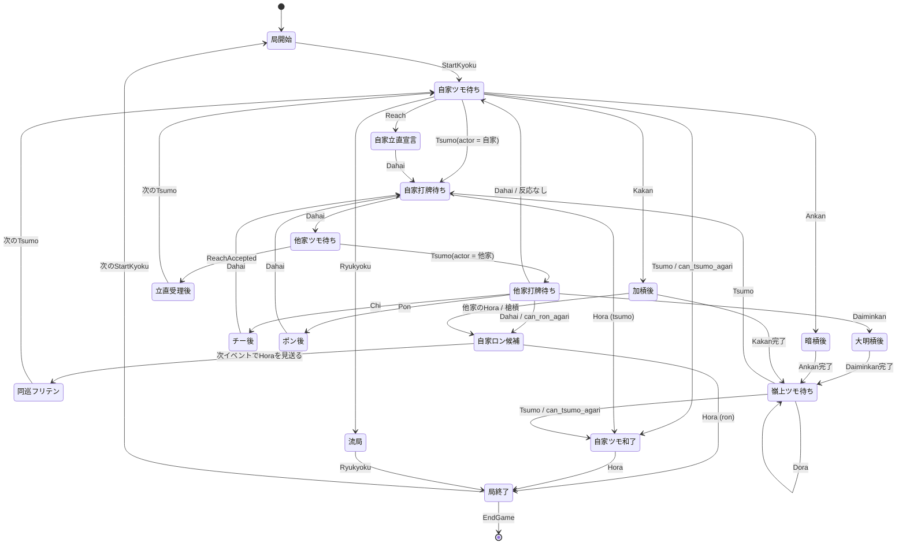
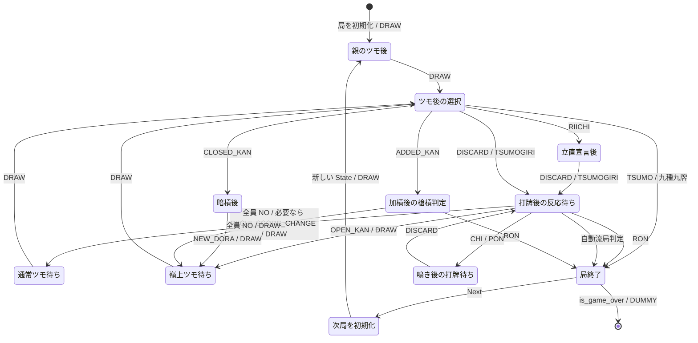
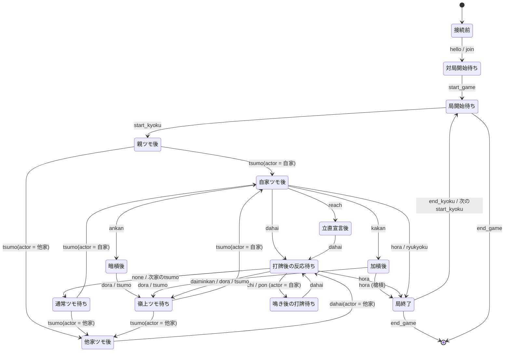
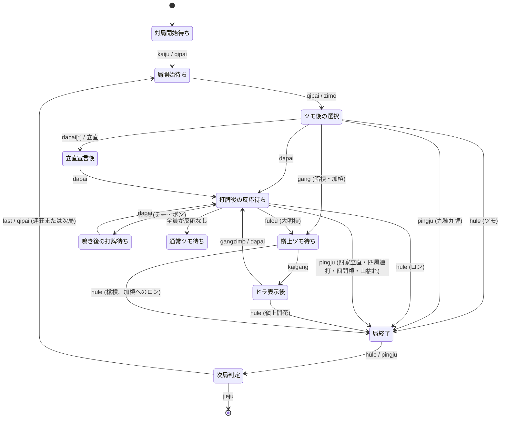
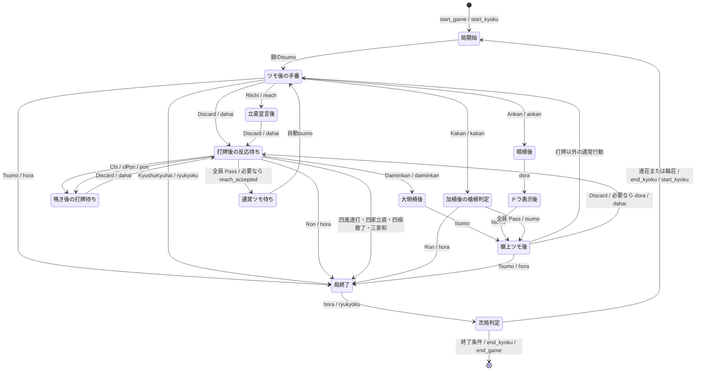

このファイルでは麻雀のゲームの状態遷移を記述します。

# 状態遷移とイベント

- 「ある状態aからある状態bに、イベントeで遷移する」とき、これを有向グラフを用いてNode a, Node b Arrow eで記述する。
- ゲームの状態遷移マシンに、イベントの列を与えると、ゲームを再生できる。reducer patternと相性がいい
- 麻雀の場合は公式のルール記述が弱く、そこから生成することは難しい。そこで、既存の実装を調べ、妥当な仕様を作り出したい。

# 既存の実装での扱い
## Mortal

### 実装の中心

Mortal の牌譜再生・観測状態は、`Mortal/libriichi/src/state/player_state.rs` の
`PlayerState` と、`Mortal/libriichi/src/mjai/event.rs` の `Event` で構成される。
`PlayerState` はゲーム全体を一つの完全情報状態として持つのではなく、
`player_id` で指定した一人の視点から見た状態を保持する。したがって、同じイベント列を
4 個の `PlayerState` に順番に入力すれば、各プレイヤーの観測状態を再生できる。

状態更新の入口は `Mortal/libriichi/src/state/update.rs` の
`PlayerState::update`（内部では `update_inner`）である。イベントを一つ受け取るたびに、
前回の合法アクション候補をクリアし、イベントの種類に応じて状態を更新し、次に可能な
アクションを `ActionCandidate` として返す。つまり、概念的には次の reducer に近い。

```text
state' = update(state, event)
actions = legal_actions(state')
```

ただし、`PlayerState` は和了後の点数精算や局終了処理を主責務にしていない。`Hora`、
`Ryukyoku`、`EndKyoku`、`EndGame` はイベント型として存在するが、`update_inner` では
状態を直接更新せず、通常は外側のゲーム進行・牌譜処理側で扱う。`StartGame` も同様に
プレイヤー局面の初期化イベントではない。

### 保持される状態

- **局のメタデータ**: 場風 `bakaze`、自風 `jikaze`、局番号 `kyoku`、本場 `honba`、
	供託 `kyotaku`、親 `oya`、点数 `scores`、順位 `rank`、オーラス判定
	`is_all_last`。点数・親などの座席情報は、対象プレイヤーを基準に相対化される。
- **手牌と山の観測**: 34種の牌数 `tehai`、赤ドラの所持、見た牌数 `tiles_seen`、
	残りツモ数 `tiles_left`、ドラ表示牌 `dora_indicators`、ドラ所持数。
	`tiles_seen` は、他家の手牌を直接公開するのではなく、イベントから観測できた牌を
	記録するためのものでもある。
- **河と副露**: 各家の河 `kawa` / `kawa_overview`、最後の捨て牌、最後の手出し、
	立直宣言牌、副露のチー `chis`・ポン `pons`・大明槓 `minkans`、暗槓 `ankans`。
	河の1項目には、捨て牌に加えて、その直前のチー・ポンやカンを関連付けて記録する。
- **手牌評価**: シャンテン数 `shanten`、待ち `waits`、フリテン `at_furiten`、
	立直後に固定される情報、食い替え禁止牌 `forbidden_tiles`。
- **局面フラグ**: 門前 `is_menzen`、立直宣言済み・受理済み、ダブル立直、
	一発 `at_ippatsu`、嶺上ツモ待ち `at_rinshan`、カン数 `kans_on_board`、
	天地和・九種九牌に関係する `can_w_riichi` など。
- **一時状態**: 直前の自家ツモ `last_self_tsumo`、直前の河の牌 `last_kawa_tile`、
	次のイベントで同巡フリテンにするための印、槍槓の可能性、カン・チー・ポンを
	次の打牌に表示するための中間情報。

### Event の種類と状態遷移

`Event` は serde の tagged enum で、JSON の `type` がイベント名になる。actor は絶対座席
番号であり、`PlayerState::rel` により自家から見た相対座席へ変換される。

#### Event 一覧

| Event | 主な意味・引数 | `PlayerState` での主な更新 | 更新後の主な候補・遷移 |
| --- | --- | --- | --- |
| `None` | 何もしないイベント | 状態を変更しない | 直前の状態を維持 |
| `StartGame` | 対局開始、プレイヤー名・seed | `PlayerState` では局面を初期化しない | 次の `StartKyoku` を待つ |
| `StartKyoku` | 場風、局、親、点数、配牌、ドラ表示牌 | 局状態をリセットし、配牌・ドラ・シャンテン・待ちを設定 | 自家のツモ待ち |
| `Tsumo` | `actor`, `pai`。山からのツモ | 残り牌を減らし、自家なら手牌・手番・直前ツモを更新 | 打牌、ツモ和了、立直、暗槓、加槓、九種九牌流局 |
| `Dahai` | `actor`, `pai`, `tsumogiri`。打牌 | 手牌、河、見た牌、手出し・ドラ・立直宣言牌を更新 | 他家打牌ならロン・チー・ポン・大明槓、自家なら次のツモ待ち |
| `Chi` | `actor`, `target`, `pai`, `consumed`。上家からの順子 | 副露、手牌、門前状態、食い替え禁止、シャンテンを更新 | 自家の打牌 |
| `Pon` | `actor`, `target`, `pai`, `consumed`。捨て牌から刻子 | 副露、手牌、門前状態、食い替え禁止、シャンテンを更新 | 自家の打牌 |
| `Daiminkan` | `actor`, `target`, `pai`, `consumed`。大明槓 | 副露、カン数、門前状態、嶺上ツモ状態を更新 | ドラ表示、嶺上ツモ |
| `Kakan` | `actor`, `pai`, `consumed`。ポンから加槓 | 副露、ポン・カン情報、カン数、嶺上ツモ状態を更新 | ドラ表示、嶺上ツモ、他家の槍槓ロン |
| `Ankan` | `actor`, `consumed`。暗槓 | 暗槓情報、手牌、カン数、嶺上ツモ状態を更新 | ドラ表示、嶺上ツモ |
| `Dora` | `dora_marker`。新しいドラ表示牌 | ドラ表示牌、ドラ係数、見たドラ情報を更新 | 通常は次のイベントを待つ |
| `Reach` | `actor`。立直宣言 | 立直宣言状態を記録し、自家なら宣言牌の打牌を可能にする | 宣言牌の打牌 |
| `ReachAccepted` | `actor`。立直受理 | 立直受理、1000点支払い、供託、一発状態、順位を更新 | 次のツモ待ち |
| `Hora` | `actor`, `target`, `deltas`, `ura_markers`。ツモ和了・ロン | 和了可能性の候補判定に使う。点数精算自体は外部で扱う | 局終了 |
| `Ryukyoku` | `deltas`。流局と点数差分 | 流局確定・点数精算は外部で扱う | 局終了 |
| `EndKyoku` | 局終了通知 | `PlayerState` は局をリセットしない | 次の `StartKyoku` |
| `EndGame` | 対局終了通知 | `PlayerState` はゲーム終了処理をしない | 状態遷移の終端 |

#### 局の開始

`StartKyoku` は局状態を全面的にリセットし、場風・局・本場・供託・親・点数・配牌・
	ドラ表示牌を設定する。手牌、河、副露、立直、フリテン、一発、カン数、残りツモ数なども
	初期化される。配牌とドラ表示牌はこの時点で「見た牌」として登録され、シャンテン数と
	待ちが計算される。初期の `tiles_left` は 70 として管理される。

#### 通常のツモと打牌

- `Tsumo(actor, pai)`: 山の残りを1枚減らす。自家のツモなら手牌へ加え、手番数、直前の
	ツモ牌を更新する。その手牌から、打牌・ツモ和了・立直・暗槓・加槓・九種九牌による
	流局の候補を計算する。他家のツモ牌は牌を直接手牌へ入れず、状態上は山の進行だけを
	反映する。
- `Dahai(actor, pai, tsumogiri)`: 自家なら手牌から牌を除き、他家ならその牌を観測済みに
	する。河へ捨て牌を追加し、手出し・ツモ切り・立直宣言牌・ドラ牌の属性を記録する。
	他家の打牌に対しては、ロン、チー、ポン、大明槓の候補を計算する。自家の打牌では
	シャンテン、待ち、フリテンなどを更新し、立直後に待ち牌を捨てた場合はフリテンにする。
	ロン可能なのに見送った場合は、次のイベントで同巡フリテンへ遷移する。

#### 鳴き

- `Chi(actor, target, pai, consumed)`: 上家の捨て牌 `pai` と手牌2枚から順子を作る。
	自家なら門前を解除し、手牌から `consumed` を除き、チー後の打牌だけを可能にする。
	食い替え禁止牌を設定し、シャンテンと打牌候補を再計算する。他家のチーは、その牌と
	消費牌を観測し、一発・立直可能状態などを更新する。
- `Pon(actor, target, pai, consumed)`: 対象牌と手牌2枚で刻子を作る。自家なら門前を解除し、
	ポンした牌種を `pons` に追加し、食い替えを禁止して打牌可能状態にする。他家の場合は
	消費牌を観測する。チー・ポンの情報は直後の打牌と結びつけるため一時保存される。

#### カンとドラ

- `Daiminkan(actor, target, pai, consumed)`: 他家の捨て牌と手牌3枚で大明槓を作る。
	カン数を増やし、嶺上ツモ待ちを設定し、副露・見た牌・一発状態を更新する。
- `Kakan(actor, pai, consumed)`: 既存のポンに手牌の同種牌を加えて加槓にする。自家なら
	手牌とポンを更新して嶺上ツモへ進める。他家の加槓では槍槓のロン候補を計算する。
- `Ankan(actor, consumed)`: 手牌4枚で暗槓を作る。暗槓情報、カン数、嶺上ツモ状態を更新し、
	自家の立直前ならシャンテンと待ちを再計算する。
- `Dora(dora_marker)`: ドラ表示牌を追加し、ドラ係数と観測済みドラ情報を更新する。
	`ReachAccepted` や `Hora` と同じく、通常の打牌権を新しく作るイベントではない。

大明槓・加槓・暗槓はいずれも `kans_on_board` を増やす。嶺上牌のツモは通常の
`Tsumo` と同じ形式で届くが、直前に設定された `at_rinshan` により嶺上開花を判定できる。
4回カン後の追加カンは `ActionCandidate` で禁止される。

#### 立直

- `Reach(actor)`: 立直を宣言した状態を記録する。自家の場合は立直宣言後の打牌を可能にし、
	宣言時点で `can_w_riichi` が真ならダブル立直として `is_w_riichi` を設定する。
- `ReachAccepted(actor)`: 立直を受理済みにし、点数から1000点を引き、供託を1本増やし、
	順位を更新する。自家なら一発状態を開始する。立直後はシャンテン計算を固定し、
	暗槓可能性などはツモごとに別途判定する。

#### 和了・流局・終了

- `Hora(actor, target, deltas, ura_markers)`: 自摸和了なら `actor == target`、ロンなら
	`target` が放銃者である。`PlayerState` はこのイベントを受けて和了処理や点数精算を
	行うのではなく、イベント列から和了可能性を候補として計算する。点数差分と裏ドラは
	イベントの `deltas` / `ura_markers` に載せられる。
- `Ryukyoku(deltas)`: 流局と点数差分を表すイベント。九種九牌による流局は `Tsumo` 後の
	`can_ryukyoku` として候補化されるが、流局の確定・点数精算は外部で扱う。
- `EndKyoku` / `EndGame`: 局・ゲームの終了通知であり、`PlayerState` の局リセットは
	次の `StartKyoku` で行われる。

### 合法アクション候補と検証

`ActionCandidate` は、現在のイベント直後に自家が選べる操作を表す。個別には
`can_discard`、チー（low/mid/high）、ポン、大明槓、加槓、暗槓、立直、ツモ和了、ロン和了、
九種九牌流局を持ち、対象座席は `target_actor` に入る。候補があるかどうかをまとめる
`can_chi`、`can_kan`、`can_agari`、`can_pass`、`can_act` も提供される。

実際のアクションイベントを送る前には `PlayerState::validate_reaction` で検証できる。
例えば、打牌が手牌に存在するか、ツモ切り牌が直前のツモと一致するか、チーが上家からの
牌か、鳴きの消費牌を手牌に持っているか、立直・和了・カンが候補として許可されているか
を確認する。不正なイベントはエラーになり、状態遷移は成功しない。

### イベント列による再生の要点

Mortalでゲームを再生するには、同じ順序の `Event` 列を `PlayerState::update` へ入力する。
`Dahai` の後に鳴きイベントが来る、鳴きやカンの後にそのプレイヤーの打牌または嶺上ツモが
来る、立直宣言の後に `Dahai`、受理の後に `ReachAccepted` が来る、というイベント列の
順序が状態を決める。イベント単体ではなく、直前イベントが設定した一時状態
（最後の捨て牌、嶺上ツモ、槍槓、同巡フリテンなど）を次のイベントが消費する点が重要である。

### 状態遷移図

以下は、`PlayerState::update` がイベント列を受け取って局面を更新する流れを、主要な
状態だけに抽象化した図である。実装では、各イベントの後に `ActionCandidate` が更新され、
自家が選択した反応イベントまたは次の自動イベントへ進む。



## mjx

### 実装の中心

mjx のゲーム進行の中心は、`mjx/include/mjx/internal/state.h` / `.cpp` の完全情報状態
`mjx::internal::State` である。環境は `Environment::RunOneRound` で各エージェントに
`Observation` を配り、返された `Action` 群を `State::Update` に渡す。`Update` は競合する
反応を解決し、状態を更新しながら、公開可能な結果だけを `mjxproto::Event` として
`PublicObservation.events` に追記する。したがって、実行時の reducer は概念的に次の形になる。

```text
(state', events) = update(state, simultaneous_actions)
observations = create_observations(state')
```

Event は `mjx/include/mjx/internal/mjx.proto` で定義され、牌譜・公開履歴の形式でもある。
Event 自体を逐次適用する公開 API は提供されないが、`State(mjxproto::State)` は保存済み
`events` を `Action` に戻し、合法な `No` を補完して同じ遷移を再実行する。このため、初期状態
（配牌、山、ドラ）と Event 列が揃えば状態を再生できる。ただし Event には非公開のツモ牌も、
見送り `No` も記録されないため、Event 列だけから完全情報状態を復元することはできない。

### 保持される状態

protobuf の `mjxproto::State` と内部補助状態は、次の情報を保持する。

- **完全情報**: `hidden_state` のゲーム seed、136 枚の山、裏ドラ表示牌。内部の `Wall` が
	配牌、通常ツモ、嶺上牌、ドラ表示牌の位置を管理する。
- **公開情報**: `public_observation` の対局 ID、起家順のプレイヤー ID、局・本場・供託・点数
	からなる開始時点の `init_score`、ドラ表示牌、Event 履歴。進行中の点数は内部の
	`curr_score_` にも保持される。
- **各家の非公開情報**: `private_observations` に各家の配牌、ツモ履歴、現在の手牌と副露を
	保持する。これを基に各プレイヤー向けの `Observation` を作り、他家の非公開情報は除外する。
- **手牌評価と一時情報**: 内部 `Player` に手牌、待ち `machi`、自分の捨て牌、見逃した牌
	`missed_tiles`、一発状態、流し満貫可能性を保持する。フリテンは待ちと捨て牌・見逃し牌の
	積集合から判定する。
- **局終端**: `round_terminal` に和了者ごとの手牌、和了牌、符、役、点数差分、裏ドラと、
	流局時の聴牌者・点数差分、最終点数、ゲーム終了判定を記録する。

初期化時には山と各家の配牌、最初のドラ表示牌を確定し、親の `DRAW` までを自動的に進める。
そのため、通常の局面は親または前の打牌者の次家がツモした後から始まる。

### Event 一覧

`who` は起家を 0 とする絶対座席である。`tile` は 0--135 の実牌 ID、`open` は天鳳形式で
符号化した副露であり、必要なイベントにだけ入る。`DRAW` はツモ牌を公開しない点が
`TSUMO`（和了）と異なる。

| Event | 主な意味・引数 | `State` での主な更新 | 更新後の主な遷移 |
| --- | --- | --- | --- |
| `DRAW` | `who` の通常ツモまたは嶺上ツモ | 山から牌を取り、当人の非公開手牌・ツモ履歴を更新 | 九種九牌、ツモ和了、暗槓、加槓、立直、打牌 |
| `DISCARD` | `who`, `tile`。手出し打牌 | 手牌から除去し、捨て牌・待ち・一発・流し満貫状態を更新 | ロン、チー、ポン、大明槓、または次家の `DRAW` |
| `TSUMOGIRI` | `who`, `tile`。直前ツモ牌の打牌 | `DISCARD` と同様。牌が直前のツモと一致することを検証 | ロン、チー、ポン、大明槓、または次家の `DRAW` |
| `RIICHI` | `who`。立直宣言 | 手牌を立直状態にする。点棒支払いはまだ反映しない | 宣言牌の打牌 |
| `RIICHI_SCORE_CHANGE` | `who`。立直受理・供託 | 1000 点を引き、供託を 1 本増やし、一発状態を開始 | 鳴きへの反応、または次家の `DRAW` |
| `CHI` | `who`, `open`。上家の牌による順子 | 手牌・副露を更新し、鳴かれた家の流し満貫可能性と全員の一発を解除 | 鳴いた家の打牌 |
| `PON` | `who`, `open`。捨て牌による刻子 | `CHI` と同様に手牌・副露・一発等を更新 | 鳴いた家の打牌 |
| `OPEN_KAN` | `who`, `open`。大明槓 | 手牌・副露・一発を更新し、嶺上ツモを実行 | `DRAW`（嶺上）後の打牌。カンドラは次の打牌直前に公開される |
| `CLOSED_KAN` | `who`, `open`。暗槓 | 手牌・副露を更新し、必要なカンドラを公開して嶺上ツモ | `NEW_DORA`、`DRAW`（嶺上） |
| `ADDED_KAN` | `who`, `open`。加槓 | 手牌・副露を更新し、本人以外の一発を保留して槍槓判定 | 他家のロン、全員 `NO` なら `DRAW`（嶺上） |
| `NEW_DORA` | `tile`。カンドラ表示 | 公開ドラと非公開裏ドラ表示牌を 1 枚ずつ追加 | 直前のカン処理を継続 |
| `TSUMO` | `who`, `tile`。自摸和了 | 和了手、役、符、点数差分、裏ドラ、最終点数を `round_terminal` に記録 | 局終了 |
| `RON` | `who`, `tile`。ロンまたは槍槓ロン | 放銃者と和了情報を確定し、ダブロン時は複数の和了を記録 | 局終了 |
| `ABORTIVE_DRAW_NINE_TERMINALS` | `who`。九種九牌 | 流局の聴牌情報・点数差分を `round_terminal` に記録 | 局終了 |
| `ABORTIVE_DRAW_FOUR_RIICHIS` | 四家立直 | 流局結果を記録 | 局終了 |
| `ABORTIVE_DRAW_THREE_RONS` | 三家和了 | 三家和了として流局結果を記録 | 局終了 |
| `ABORTIVE_DRAW_FOUR_KANS` | 四槓散了 | 流局結果を記録 | 局終了 |
| `ABORTIVE_DRAW_FOUR_WINDS` | 四風連打 | 流局結果を記録 | 局終了 |
| `EXHAUSTIVE_DRAW_NORMAL` | 通常流局 | 聴牌者とノーテン罰符を計算して記録 | 局終了 |
| `EXHAUSTIVE_DRAW_NAGASHI_MANGAN` | 流し満貫 | 流し満貫の和了相当の点数結果を記録 | 局終了 |

`NO` は反応を見送る `Action` であり、公開されないため Event には存在しない。`State::Update`
は複数人の反応を `RON > OPEN_KAN > PON > CHI > NO` の優先順位で解決する。複数ロンは放銃者の
上家から順に処理し、3 人ロンだけは `ABORTIVE_DRAW_THREE_RONS` にする。

### 主な遷移と自動処理

- `DRAW` 後には本人だけに選択肢を返す。九種九牌、ツモ和了、暗槓・加槓、立直、手出し・
	ツモ切りが候補になり、四槓散了となる 5 回目のカンは候補から除かれる。
- 打牌後は、反応可能な各家にロンと `NO`、条件を満たす家にチー・ポン・大明槓を返す。
	反応がなければ、立直受理の `RIICHI_SCORE_CHANGE` を必要な時点で挿入してから次家の
	`DRAW` を自動追加する。見送りは Event に残らないが、`missed_tiles` を更新して同巡
	フリテンに反映する。
- 鳴き後は鳴いた家だけが打牌する。大明槓・暗槓は嶺上ツモへ進み、加槓だけは先に他家の
	槍槓ロンを受け付ける。カンドラはカンの種類と直前のカン処理により、暗槓時または次の
	打牌直前に `NEW_DORA` として追加される。
- 局終了後、`State::Next` が親の和了・聴牌、途中流局、点数、局数に基づき、連荘、輪荘、
	本場、供託、次局の開始点数を決める。`Environment` はその `ScoreInfo` から新しい `State`
	を構築する。ゲーム終了時には全員が `DUMMY` Action を返して終端情報を受け取る。

### 状態遷移図

以下は `State::Update` と `CreateObservations` の主要な制御状態を抽象化した図である。
四家立直・四槓散了・海底などの自動判定は、打牌または `NO` の後に同じ局終了経路へ入る。



## mjai-manue

### 実装の中心

mjai-manue の対局状態は、`mjai-manue/coffee/game.coffee` の `Game` が保持する。これは
ルールを完全情報で実行するゲームエンジンではなく、mjai サーバーが確定させた mjsonp の
`Action` 列を逐次反映し、AI の意思決定に必要な公開情報と自分を含む各家の手牌情報を持つ
観測状態である。ネットワーク対戦では `TCPClientGame.onReceiveLine` が JSON を
`Action.fromJson` で復元して `Game.updateState` に渡し、牌譜再生では
`Archive.play` が同じ `updateState` を呼ぶ。

概念的な reducer は次の形になる。合法性の検証、反応競合の解決、ツモ牌の秘匿、和了・流局
の判定と点数計算はサーバー側の責務であり、`Game` は受信済みの結果を適用するだけである。

```text
state' = updateState(state, server_action)
response = ai.respondToAction(server_action, state')
```

`Action` は `action.coffee` の可変フィールドを持つオブジェクトで、JSON の snake_case
フィールドを camelCase のプロパティへ変換する。`actor`、`target`、`oya` は開始時に作った
4 人の `player` オブジェクトを参照し、牌文字列は `Pai`、副露は `Furo` に復元する。
クライアントがサーバーへ返すのも `Action` であり、行動しないときは `{type: "none"}` を返す。

### 保持される状態

- **アクション履歴**: 現在の `currentAction`、直前の `previousAction`。直前の他家打牌が
  和了で終わらなかった場合に、その牌を安全牌候補へ追加するためにも使う。
- **局メタデータ**: 場風 `bakaze`、局番号 `kyokuNum`、本場 `honba`、親 `oya`、起家
  `chicha`、ドラ表示牌 `doraMarkers`、通常ツモの残数 `numPipais`。残数は局開始時 70 とし、
  `tsumo` ごとに 1 減らす。供託 `kyotaku` は Action のフィールドにはあるが、`Game` の状態
  としては保持しない。
- **各プレイヤー**: ID・名前・点数、手牌 `tehais`、副露 `furos`、現在の河 `ho`、その局で
  捨てた全牌 `sutehais`、追加安全牌 `extraAnpais`、立直状態 `reachState`、立直牌の河・捨て牌
  上の位置 `reachHoIndex` / `reachSutehaiIndex` を持つ。通常の接続ではサーバーが非公開牌を
  `?` として渡し、`deleteTehai` はその未知牌も消費牌として扱える。
- **派生情報**: `doras()` は表示牌からドラ牌を求め、`visiblePais(player)` は自家手牌、全河、
  全副露、ドラ表示牌を列挙する。`anpais(player)` は自分の捨て牌と、和了されずに通過した
  他家打牌を結合する。聴牌はキャッシュ `tenpais` を毎アクションで無効化し、必要時に
  `ShantenAnalysis` から算出する。

### Event 一覧

下表の Event は、サーバーから到着して `Game.updateState` に渡る主な `Action.type` である。
`possible_actions` と `cannot_dahai` は状態を更新しないが、当該イベントの受信者が次に返せる
行動候補・食い替え禁止牌として AI に渡される。

| Event | 主な意味・引数 | `Game` での主な更新 | AI/次の遷移 |
| --- | --- | --- | --- |
| `hello` | `protocol`, `protocol_version` | `Game` を更新しない。`TCPClientGame` が mjsonp v2 以上を確認する | `join` を送信 |
| `start_game` | `id`, `names` | 4 人を作成し、局メタデータを未設定へ戻す。各家を 25000 点、手牌・河・副露を未初期化にする。自家 ID を保存し AI を初期化する | `start_kyoku` を待つ |
| `start_kyoku` | `bakaze`, `kyoku`, `honba`, `oya`, `dora_marker`, `tehais` | 局メタデータ、初期ドラ、残りツモ数 70 を設定。各家の手牌、河、副露、安全牌、立直状態を局ごとに初期化する | 親の `tsumo` を待つ |
| `tsumo` | `actor`, `pai` | 残りツモ数を 1 減らし、当人の手牌にツモ牌を加える | 自家なら打牌・立直・和了・カン等の `possible_actions` を見て応答、他家なら待機 |
| `dahai` | `actor`, `pai`, `tsumogiri` | 当人の手牌から牌を除き、ソートして河と捨て牌履歴へ追加する。立直未受理なら追加安全牌をリセットする | 他家打牌ならロン・チー・ポン・大明槓を選ぶか `none`、反応なしなら次家の `tsumo` |
| `chi` | `actor`, `target`, `pai`, `consumed` | 鳴いた家の消費牌を手牌から除き、`Furo` を追加する。放鳴された家の河末尾を取り除く | 鳴いた家の `dahai` |
| `pon` | `actor`, `target`, `pai`, `consumed` | `chi` と同じく消費牌・副露・放鳴牌を更新する | 鳴いた家の `dahai` |
| `daiminkan` | `actor`, `target`, `pai`, `consumed` | 消費牌を除いて大明槓の `Furo` を追加し、放鳴牌を河から除く | サーバーがドラ表示を経て嶺上の `tsumo` を送る |
| `ankan` | `actor`, `consumed` | 消費した 4 枚を手牌から除き、暗槓の `Furo` を追加する | サーバーがドラ表示を経て嶺上の `tsumo` を送る |
| `kakan` | `actor`, `pai` | 手牌から追加牌を除き、同牌種の既存 `pon` を `kakan` の `Furo` に置換する。不整合なら例外にする | 槍槓への反応、またはドラ表示・嶺上 `tsumo` |
| `dora` | `dora_marker` | ドラ表示牌を追加する | 次の自動イベントを待つ |
| `reach` | `actor` | 当人の `reachState` を `declared` にする | 宣言牌の `dahai`。自家なら可能なら和了、そうでなければ打牌を返す |
| `reach_accepted` | `actor` | `reachState` を `accepted` にし、直前の河・捨て牌を立直牌の位置として記録する | 次のツモまたは他家の反応を待つ |
| `hora` | `actor`, `target`, `hora_tehais`, `yakus`, `fu`, `fan`, `hora_points`, `scores` | 手牌・河などは直接変更しない。`scores` があれば全員の点数を更新する。直前打牌は安全牌へ加えない | 局終了。次の `start_kyoku` または `end_game` |
| `ryukyoku` | `tenpais`, `deltas`, `scores` | 流局の局面情報は保存せず、`scores` があれば点数だけを更新する | 局終了。次の `start_kyoku` または `end_game` |
| `end_kyoku` | 局終了通知 | `Game` は局状態を消去しない | 次の `start_kyoku` を待つ |
| `end_game` | 対局終了通知 | `Game` は終端フラグを持たない。`TCPClientGame` は受信後にソケットを閉じる | 終端 |
| `error` | サーバーエラー | `Game` を更新しない | TCP 接続を閉じる |

### 主な遷移と AI の応答

`TCPClientGame` は各アクションを適用した後に `AI.respondToAction` を呼び、その戻り値を
JSON にしてサーバーへ返す。`ManueAI` は自家の `tsumo`、`chi`、`pon`、`reach` では和了候補を
優先し、次に立直または打牌を選ぶ。他家の `dahai` と `kakan` では、和了候補を優先してから
副露候補を評価する。それ以外、または見送り時は `none` である。したがって反応の合法性や
競合解決は AI ではなくサーバーが担う。

`end_kyoku`、`hora`、`ryukyoku` は局状態を初期化しない。次の `start_kyoku` が各家の手牌・河・
副露・立直状態をリセットする境界である。この性質により、`Archive.play` は牌譜の各行を
同じ順序で反映して、対局中に AI が見た状態を再構成できる。ただし未知牌を `?` として扱う
観測状態であるため、牌譜から完全情報の山や他家の手牌を復元するものではない。

### 状態遷移図

以下は、サーバーが確定した Action をクライアントが受信する順序と、AI が応答する主要な
制御状態を抽象化した図である。`none` の送信、反応競合の解決、カンドラ・嶺上牌の供給は
サーバー側の処理なので、次に届く Event として表した。



## Majiang

### 実装の中心

Majiang は、`@kobalab/majiang-core` 1.3.5 の `Game`、`Player`、`Board`、`Shan`、
`Shoupai`、`He` にゲーム状態と局進行を分担させている。トップレベルの
`Majiang/src/js/index.js` では 4 個の `Player`（画面操作のプレイヤーまたは AI）を
`new Majiang.Game(players, callback, rule)` に渡し、`game.kaiju()` で対局を開始する。
ネット対戦では `Majiang.UI.Player.action(msg)` がサーバーから受け取ったメッセージを
同じ `Player` の更新処理へ渡す。

ここでいう Event は、専用の enum ではなく、牌譜にも記録される action message である。
例えば `{ zimo: { l: 1, p: "m5" } }` や `{ dapai: { l: 1, p: "m5" } }` のように、
イベント名をキーにしたオブジェクトで表される。`Player.action` はキーを見て
`kaiju`、`qipai`、`zimo`、`dapai`、`fulou`、`gang`、`gangzimo`、`kaigang`、
`hule`、`pingju`、`jieju` のいずれかを呼ぶ。

概念的には、Majiang の通常対局は次の二段構造の reducer である。

```text
responses = ask_players(state, event)
state'    = Game.apply(event, responses)
next      = resolve_reactions(state')
```

`Game` が山・全員の手牌・河・点数を含む完全情報状態を更新し、そのイベントを各家向けに
変換して `Player.action` へ通知する。自家のツモ牌はその家だけに送られ、他家には空文字が
送られる。各 `Player` は `Board` に公開情報と自分の手牌を反映し、`action_*` メソッドで
次の返答（打牌、鳴き、和了、流局など）を選ぶ。したがって牌譜を完全情報の `Game` に
逐次適用する場合と、各家の観測状態を `Player` に逐次適用する場合を分けて考える必要がある。

### 保持される状態

- **対局・局のメタデータ**: `Game._model` の対局タイトル、起家 `qijia`、場風
	`zhuangfeng`、局 `jushu`、本場 `changbang`、供託 `lizhibang`、各家の点数 `defen`、
	座席とプレイヤー ID の対応 `player_id`。
- **牌山 `Shan`**: 未公開牌、残りツモ数 `paishu`、ドラ表示牌 `baopai`、裏ドラ表示牌、
	カン成立待ち `_weikaigang`、牌山の閉鎖状態。通常ツモは末尾から、嶺上ツモは先頭から
	取り、`kaigang` でカンドラを公開する。
- **各家の手牌 `Shoupai`**: 牌の枚数、ツモ牌 `_zimo`、副露 `_fulou`、立直状態 `_lizhi`。
	手牌操作は `zimo`、`dapai`、`fulou`、`gang` が行い、赤牌と未知牌も牌文字列表現で扱う。
- **各家の河 `He`**: 捨て牌列 `_pai` と、牌種ごとの捨て牌検索表 `_find`。鳴きが発生すると
	直前の捨て牌に `+`、`=`、`-` の相対方向を付け、どの捨て牌から鳴いたかを保持する。
- **進行用の一時状態**: 現在の手番 `lunban`、直前の捨て牌 `_dapai`、カン対象 `_gang`、
	立直段階 `_lizhi`、一発 `_yifa`、各家のカン数 `_n_gang`、見逃しによるロン可否
	`_neng_rong`、第一ツモ中 `_diyizimo`、四風連打判定 `_fengpai`、和了者列 `_hule`。
- **局終了結果**: 点数移動 `_fenpei`、連荘 `_lianzhuang`、途中流局・対局終了フラグ、
	和了または流局を含む牌譜 `_paipu`。`jieju` では最終点数 `defen`、順位 `rank`、順位点
	`point` を確定する。
- **プレイヤーの観測状態**: `Player._model` は `Board` で、局情報、4 家の手牌と河、牌山の
	残数、ドラ、点数を保持する。ただし `qipai` では自家以外の配牌を空文字、他家の `zimo`
	ではツモ牌を空文字として受信する。AI や画面プレイヤーが判断する状態はこの観測状態である。

### Event 一覧

| Event | 主なデータ | `Game` / `Player` の更新 | 更新後の主な遷移 |
| --- | --- | --- | --- |
| `kaiju` | 対局 ID、起家、ルール、プレイヤー名 | 対局情報を設定し、牌譜を初期化する。`Board.kaiju` は局情報と座席対応を初期化する | 最初の `qipai` |
| `qipai` | 場風、局、本場、供託、点数、ドラ、4 家の配牌 | `Game` が牌山から各家へ13枚配り、河・立直・カン数・一発などをリセットする。`Player` は自家の配牌だけを完全情報で受け取る | 親の `zimo` |
| `zimo` | `l`、`p`。`l` の通常ツモ | `Shan.zimo` と対象家の `Shoupai` を更新し、手番を進める。他家向けには `p` を隠す | ツモ和了、九種九牌、暗槓・加槓、立直、打牌 |
| `dapai` | `l`、`p`。末尾 `*` は立直宣言牌 | 手牌から除き、河へ追加する。`*` なら立直支払い・供託は反応解決時に行う。一発・第一ツモ・ロン可否も更新する | ロン、ポン、チー、大明槓、次家の `zimo` |
| `fulou` | `l`、`m`。副露面子と鳴かれた方向 | `He.fulou` で鳴かれた河牌に方向を付け、`Shoupai.fulou` で消費牌を除いて副露を追加する。`m` が4枚なら大明槓としてカン待ちにする | チー・ポン後の打牌、または大明槓後の `gangzimo` |
| `gang` | `l`、`m`。暗槓または加槓の面子 | `Shoupai.gang` で暗槓を追加するか既存ポンを加槓へ置換する。加槓なら他家の槍槓反応を受ける | 槍槓和了、または `gangzimo` |
| `gangzimo` | `l`、`p`。嶺上ツモ | 牌山の嶺上牌を取り、カン成立に伴うドラ表示を必要に応じて公開する。嶺上牌は本人以外には隠す | 嶺上開花、暗槓・加槓、打牌 |
| `kaigang` | 新しいドラ表示牌 `baopai` | `Shan.kaigang` と各 `Board` のドラ表示牌を更新する | 原則として直前のカン処理を継続 |
| `hule` | 和了者 `l`、和了形、放銃者 `baojia`、役・符・点数差分 `fenpei`、裏ドラ | 和了形と点数移動を記録する。ツモなら `baojia` はなく、ロンなら放銃者を持つ。複数和了は順番に処理される | 次の和了処理、局終了、`last` |
| `pingju` | 流局名 `name`、聴牌手牌、点数差分 | 荒牌平局、九種九牌、四風連打、四家立直、四開槓、三家和などを記録し、ノーテン罰や流し満貫を計算する | 局終了、`last` |
| `jieju` | 最終牌譜、最終点数、順位、順位点 | 対局を終端にし、最終点数へ供託を加算して順位・ポイントを確定する | 終端 |

`fulou` の `m` は、`+` が下家から、`=` が対面から、`-` が上家からの牌を示す。
従ってチー・ポン・大明槓は別 Event 名ではなく `fulou` の面子表現で区別される。
一方、暗槓・加槓は `gang` であり、4枚の面子は暗槓、既存ポンに1枚を加える面子は加槓である。

### 主な遷移と反応解決

- 対局開始時、`kaiju` の全員応答を受けると `Game.reply_kaiju` が `qipai` を開始する。
	`qipai` の全員応答後は親から `zimo` を行う。
- `zimo` 後は手番のプレイヤーだけが、九種九牌 `daopai`、ツモ和了 `hule`、カン
	`gang`、立直付きまたは通常の `dapai` を返す。応答が不正または欠けた場合は合法な
	打牌の最後の候補を選ぶ。
- `dapai` 後は、まず下家・対面・上家の順に `hule` を調べる。ロンがなければポンまたは
	大明槓を優先し、最後に上家のチーを調べる。誰も反応しなければ次家の `zimo` に進む。
	立直宣言牌ならここで1000点を引き、供託を増やす。四家立直、四風連打、四開槓、山の
	枯渇による流局もこの反応解決の後に自動判定される。
- `fulou` 後は、鳴いた家だけが打牌する。`fulou` が大明槓なら通常打牌ではなく
	`gangzimo` へ進む。`gang` の暗槓も `gangzimo` へ進み、加槓だけは先に他家へ槍槓の
	`hule` 反応を配る。
- 和了時は `Game.hule` が和了形・役・符・点数差分を計算し、複数和了が残っていれば
	続けて処理する。流局時は `Game.pingju` が聴牌者と点数差分を決める。処理後に
	`last` が連荘、本場、供託、次局番号を更新し、続行なら新しい `qipai`、終了条件を満たす
	なら `jieju` に進む。
- `Player` 側では `action_zimo`、`action_dapai`、`action_fulou`、`action_gang`、
	`action_hule`、`action_pingju` が返答を作る。合法性判定は主に `Game.get_*` と
	`Game.allow_*`（打牌、チー、ポン、カン、立直、和了、九種九牌）が担い、反応の競合解決は
	`Game.reply_dapai` / `reply_gang` が担う。

### 状態遷移図



## RiichiEnv

### 実装の中心

RiichiEnv の通常対局を進行する中心は、`RiichiEnv/riichienv-core/src/state/mod.rs` の
完全情報状態 `GameState` である。Python API の `RiichiEnv.step(actions)` は各家から渡された
`Action` を `GameState::step` に渡し、合法性検証、反応の競合解決、山からのツモ、点数精算、
次局初期化までを一つの状態遷移として処理する。`Action` は `action.rs` で定義され、打牌、
チー、ポン、カン、和了、立直、見送りなどを表す。概念的には次の reducer である。

```text
state' = step(state, actions_for_active_players)
observations = get_observation(state', active_players)
```

ここで `actions` は常に4人分を必要としない。通常手番では `current_player` のみ、打牌後または
加槓後の反応段階では `active_players` に入った複数家が同時に入力する。`GameState` は
`WaitAct`（手番行動待ち）と `WaitResponse`（副露・ロン反応待ち）の二相を持ち、`step` は
未入力の反応を見送りとして扱う。

牌譜再生には同じ `GameState` の `apply_mjai_event` を用いる。MJAI JSON を
`replay::MjaiEvent` に復元し、一イベントずつ手牌・河・副露などへ適用する。これは牌譜の
公開イベントを再現する入口であり、`step` のような反応競合解決や山の完全な再構成は行わない。
通常対局では `GameState` 自身が MJAI イベントを生成し、各家向けには他家の手牌とツモ牌を
伏せた履歴を `Observation.new_events` として渡す。3人打ちは並行した `state_3p::GameState3P`
で実装され、同じ構造に北抜き `Kita` と3人用の山・行動空間を加える。

### 保持される状態

- **山と完全情報**: `WallState` はシャッフル済みの山、残り通常ツモ数 `drawable_count`、
  ドラ表示牌、嶺上ツモ回数、保留中のカンドラ数を持つ。通常ツモは山末尾、嶺上ツモは先頭から
  取り出す。
- **各家の状態**: 4家それぞれについて、完全な手牌、副露、河、手出し／ツモ切り属性、
  立直宣言牌、点数と点数差分を保持する。立直は宣言中 `riichi_stage` と受理済み
  `riichi_declared` を区別し、ダブル立直、見逃しによる同巡／立直フリテン、一発、
  流し満貫可否、責任払い `pao`、食い替え禁止牌も管理する。
- **局のメタデータ**: 親 `oya`、場風 `round_wind`、局番号 `kyoku_idx`、本場 `honba`、
  供託 `riichi_sticks`、第一巡かどうか、残りの局・ゲームモード・ルール設定を持つ。
- **進行中の制御状態**: 現手番 `current_player`、`phase`、行動入力を待つ家
  `active_players`、直前の捨て牌 `last_discard`、各家の反応候補 `current_claims`、
  槍槓判定中の `pending_kan`、直前ツモ牌 `drawn_tile`、嶺上フラグを持つ。
- **局結果と履歴**: 和了結果 `win_results`、局終了時点の点数、MJAI ログ、各家ごとのマスク済み
  MJAI ログを保持する。`get_observation(player_id)` は自家手牌だけを公開し、現在合法な
  `Action`、待ち、河、副露、ドラ、点数、今回新規のイベントを返す。

### Action と MJAI Event

実行時の入力は `ActionType` であり、`Discard`、`Chi`、`Pon`、`Daiminkan`、`Ron`、
`Riichi`、`Tsumo`、`Pass`、`Ankan`、`Kakan`、`KyushuKyuhai`（3人打ちでは `Kita` も）を持つ。
`tile`、`consume_tiles`、`actor` が付随し、`step` は現在の合法候補と照合して不正な入力を
流局扱いにする。

通常対局で出力され、牌譜再生で入力される主な `MjaiEvent` は以下である。`actor` と
`target` は絶対座席番号である。

| Event | 主な意味・引数 | `GameState` での主な更新 | 次の遷移 |
| --- | --- | --- | --- |
| `start_game` | 対局開始 | イベント履歴を開始する。通常局面は続く `start_kyoku` で初期化する | 局開始 |
| `start_kyoku` | 場風、局、本場、供託、親、点数、ドラ表示牌、配牌 | 局の一時状態をリセットし、各家の手牌、点数、ドラ、残りツモ数を設定する | 親の `tsumo` |
| `tsumo` | `actor`, `pai` | 手番家の手牌へ牌を加え、山と残りツモ数を減らす。通常実行では合法行動を再計算する | 打牌、立直、和了、暗槓、加槓、九種九牌 |
| `dahai` | `actor`, `pai`, `tsumogiri` | 手牌から除き河へ追加する。手出し属性、立直宣言牌、フリテン、流し満貫可否を更新する | 他家のロン・チー・ポン・大明槓、または次家の `tsumo` |
| `chi` | `actor`, `target`, `pai`, `consumed` | 消費牌を除き順子副露を追加する。食い替え禁止、一発、流し満貫可否を更新する | 鳴いた家の `dahai` |
| `pon` | `actor`, `target`, `pai`, `consumed` | 消費牌を除き刻子副露を追加する。食い替え禁止、一発、流し満貫可否を更新する | 鳴いた家の `dahai` |
| `daiminkan` / `kan` | `actor`, `target`, `pai`, `consumed` | 大明槓を副露へ追加し、一発を消し、嶺上ツモ状態にする | `tsumo`（嶺上）、後続の `dora` |
| `ankan` | `actor`, `consumed` | 手牌4枚を暗槓へ移し、嶺上ツモ状態にする | `dora`、`tsumo`（嶺上） |
| `kakan` | `actor`, `pai` | 手牌の1枚を既存ポンに加え、加槓へ置換する | 他家の槍槓ロン、または嶺上 `tsumo` |
| `dora` | `dora_marker` | 新しいカンドラ表示牌を追加する | 直前のカン処理を継続 |
| `reach` | `actor` | 立直を宣言中にし、宣言牌の打牌を聴牌維持牌に限定する | `dahai` |
| `reach_accepted` | `actor` | 1000点を支払い供託を増やし、立直受理・一発状態にする | 反応なしなら次家の `tsumo` |
| `hora` | `actor`, `target`, `deltas`, `ura_markers` | 通常実行では役・符・点数を計算して和了結果と点数を確定する。再生時は終局として扱う | 次局または終局 |
| `ryukyoku` | `reason`, `deltas` | 九種九牌、荒牌平局、流し満貫、途中流局などの結果と点数を確定する。再生時は終局として扱う | 次局または終局 |
| `end_kyoku` | 局終了通知 | 通常実行では次局初期化の境界としてログ出力する | `start_kyoku` または `end_game` |
| `end_game` | 対局終了通知 | `is_done` を立て、以降の合法行動を空にする | 終端 |

### 主な遷移と競合解決

- `WaitAct` では `current_player` だけが行動する。ツモ後の合法候補は打牌、ツモ和了、立直、
  暗槓、加槓、九種九牌であり、立直後は原則ツモ切りだけに制限される。立直中の暗槓は待ちが
  変化しない場合だけ候補になる。
- 打牌後の `_resolve_discard` は全他家のロン・ポン・大明槓・チー候補を作って `WaitResponse`
  へ移る。複数入力は `Ron` を最優先し、鳴きならポン／大明槓をチーより優先する。ロンを
  見送った家は同巡フリテンとなり、立直中なら恒久フリテンにもなる。
- 全員が見送ると、立直宣言を受理して供託と一発を確定し、途中流局を検査してから次家を
  自動ツモさせる。四風連打、四家立直、複数人による四槓散了、山切れはこの経路で流局になる。
- 暗槓・大明槓・加槓は `_resolve_kan` で副露を更新し、一発を消して嶺上牌をツモする。暗槓は
  直ちにカンドラを開き、大明槓・加槓のカンドラは次の打牌前まで保留する。加槓は副露更新後に
  他家の槍槓ロンを待ち、暗槓もルール設定により国士無双の槍槓判定を行える。
- `Tsumo` と `Ron` は役・符・ドラ・裏ドラ・本場・供託・責任払いを考慮して点数を計算する。
  複数ロンは放銃者からの距離順に処理し、ルールで三家和を途中流局にできる。和了・流局後は
  親の和了／聴牌、点数、ゲームモードにより連荘・輪荘・本場を決めて次局を初期化し、条件を
  満たせば `end_kyoku` と `end_game` を出して終端にする。

### 状態遷移図

以下は4人打ちの `GameState::step` を抽象化した図である。`Action` はエージェント入力、
MJAI Event 名は状態更新時に生成される公開履歴でもある。`Pass` または入力なしは反応なしを
表す。


